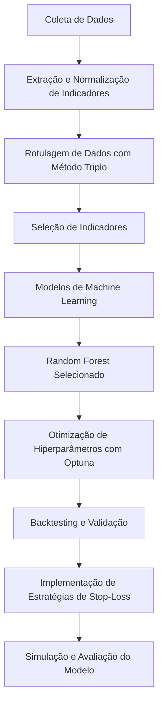

# Field Project - Trend Following de ativos com poucos dados - Cartesius Capital

## Introdução

O mercado financeiro é altamente dinâmico e complexo, e a identificação de tendências é crucial para decisões estratégicas. O método *trend following* busca capturar movimentos persistentes nos preços dos ativos. Com o avanço do aprendizado de máquina, foi possível aprimorar as estratégias tradicionais de *trend following*, como médias móveis e o MACD, com modelos preditivos mais robustos.

Este projeto foi desenvolvido em parceria entre a Escola de Matemática Aplicada da FGV e a Cartesius Capital, com o objetivo de criar um modelo de *trend following* para ativos com dados limitados. A solução proposta utiliza aprendizado supervisionado e integra uma série de indicadores técnicos.

## Rotulador

A rotulagem dos dados foi realizada usando o **método de barreira tripla**, que define três categorias para os rótulos: `0`, `1`, e `-1`, dependendo do sucesso ou fracasso de uma operação, ou do encerramento após um tempo fixo. O processo foi baseado no cálculo de retornos logarítmicos diários e em barreiras ajustadas pela volatilidade, utilizando o desvio padrão móvel ponderado exponencialmente (EWMSD).

Foi implementado um sistema que alterna entre o método de barreira tripla e o método de horizonte fixado, dependendo das condições do mercado.

## Modelos de Machine Learning

Após a extração e normalização dos dados, três modelos de *machine learning* foram testados para prever os sinais de operação:
redes neurais, random forest, gradient boosting. Após testes preliminares, o **Random Forest** foi escolhido devido à sua eficiência computacional e bom desempenho em comparação com outros modelos mais complexos.

## Indicadores

Diversos indicadores técnicos foram utilizados para auxiliar a previsão do comportamento dos preços:

- **Trend Indicators**: Identificam a direção do mercado, como o MACD, ADX, e Ichimoku Cloud.
- **Oscillators**: Identificam condições de sobrecompra e sobrevenda, como o RSI, Stochastic Oscillator, e Bollinger Bands.
- **Volume-Based Indicators**: Relacionam volume e preço, como o On-Balance Volume (OBV).

Esses indicadores foram combinados para criar um conjunto robusto de variáveis preditivas, permitindo que o modelo de *machine learning* fosse mais eficaz.

## Treinamento e Dados Utilizados

O modelo foi treinado com dados históricos de quatro ações: TSLA (Tesla), VIVARA, PRIO (PetroRio) e AZUL (Azul Linhas Aéreas). A quantidade limitada de dados reflete um cenário desafiador para desenvolver modelos de *trend following* eficazes.

### Otimização de Hiperparâmetros com Optuna
A otimização de hiperparâmetros foi feita utilizando a ferramenta Optuna, que explora diferentes combinações para encontrar a configuração que maximiza o desempenho do modelo. A validação foi realizada em múltiplos anos para garantir a adaptabilidade do modelo.

### Sinais de Operação e Política de Stop-Loss
O modelo gera sinais operacionais (compra, venda, ou liquidação de posições), com uma política de stop-loss de 5% para limitar perdas. Utilizou-se a biblioteca **backtesting.py** para simular o desempenho histórico do modelo.

### Binarização
Dois modelos foram testados: o **Modelo Não Binarizado**, que prevê sinais contínuos, e o **Modelo Binarizado**, que utiliza duas florestas aleatórias para gerar decisões operacionais, garantindo maior robustez.

### Cálculo da Volatilidade
A volatilidade foi calculada com base nos *log returns* dos ativos, permitindo ajustar a estratégia conforme o risco do mercado.

### Validação e Treinamento por Ano
O modelo foi projetado para ser validado e treinado em qualquer ano específico, permitindo avaliações personalizadas.

## Fluxograma do Processo

Abaixo, um fluxograma para ilustrar o processo de desenvolvimento do modelo.

